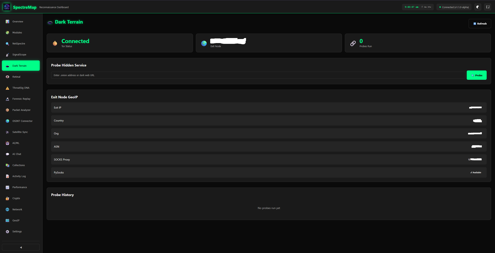
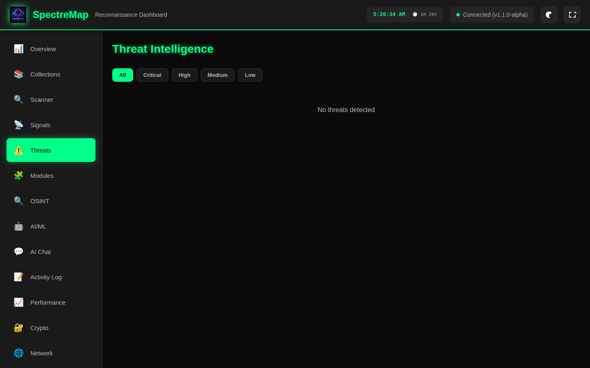
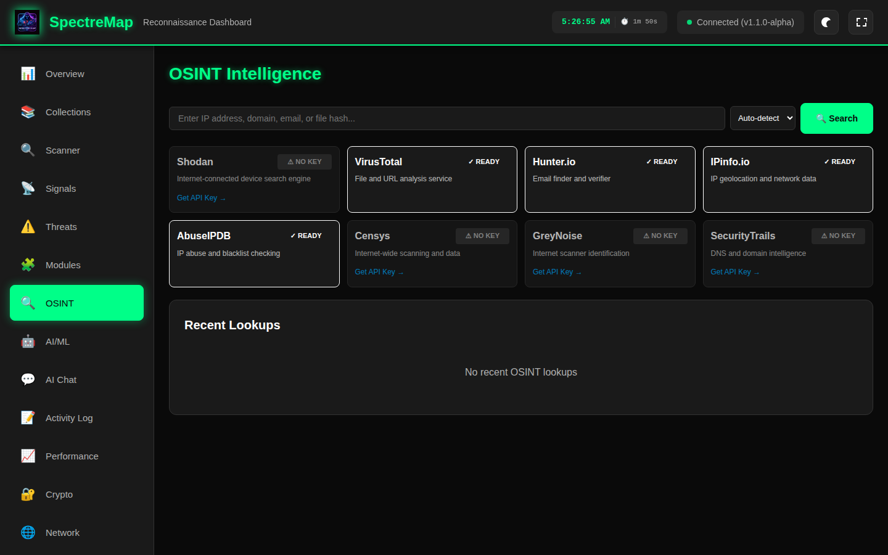
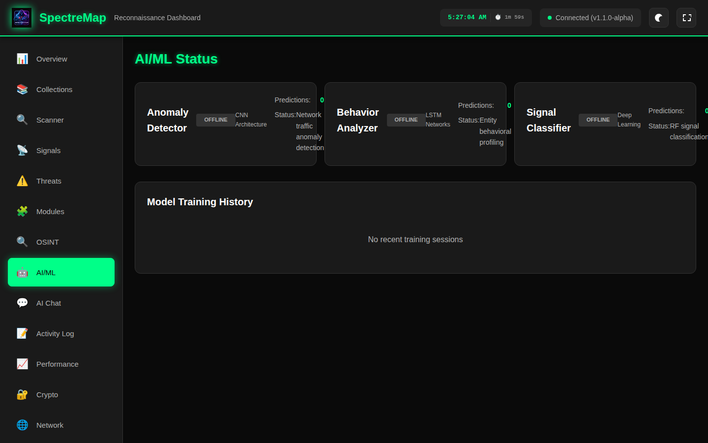
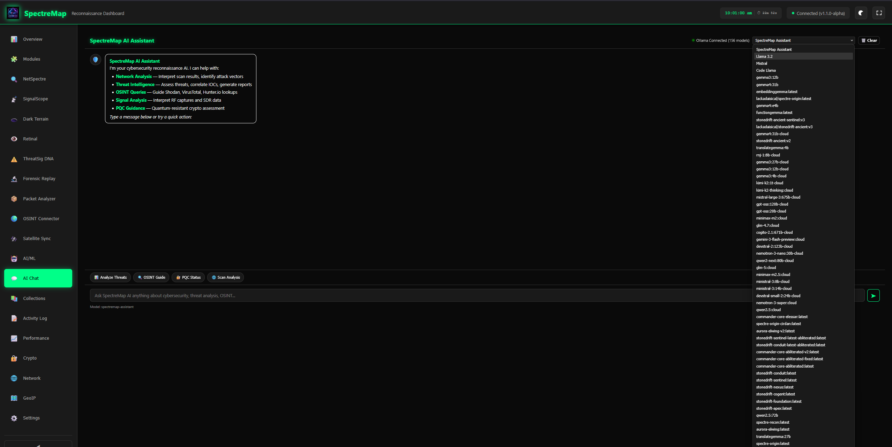
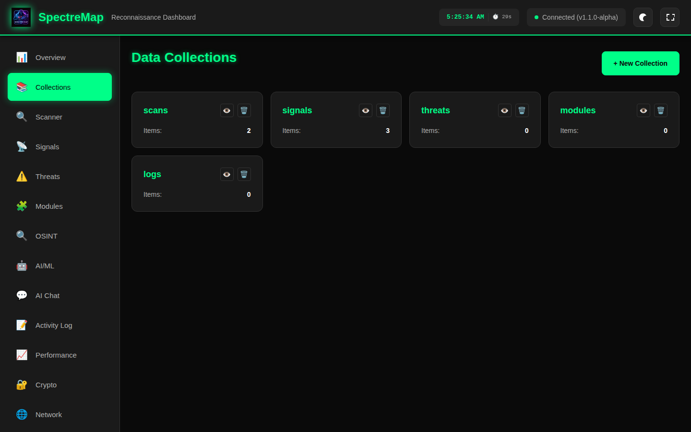
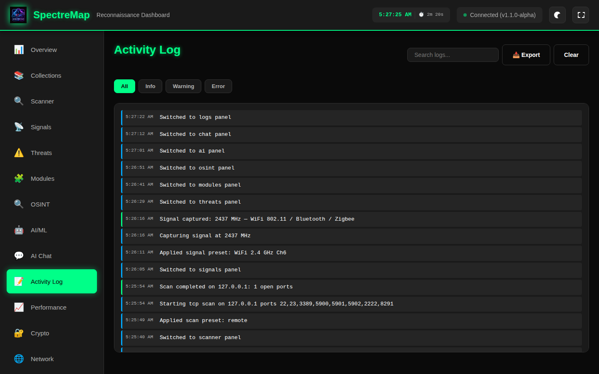
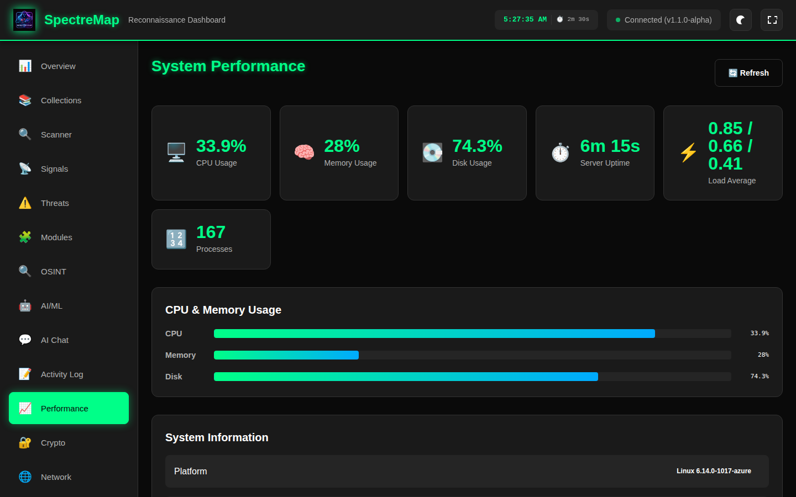
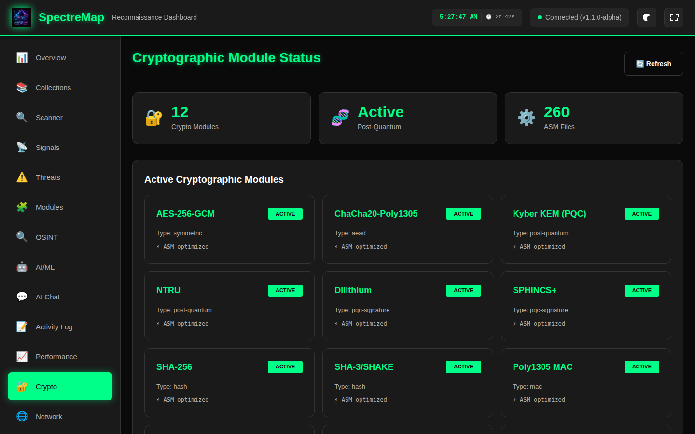
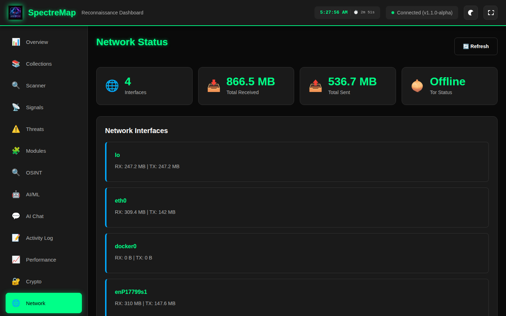

<div align="center">

# SpectreMap

  
  
**Visual Reconnaissance & Threat Terrain Mapper**
  
*Professional-grade cybersecurity reconnaissance platform for authorized security testing*

**Version 1.1.4-alpha** | **Copyright © 2025-2026 Lackadaisical Security**

[](https://github.com/Lackadaisical-Security/SpectreMap)
[](LICENSE)
[]()

**Contact**: lackadaisicalresearch@pm.me  
**XMPP+OTR**: thelackadaisicalone@xmpp.jp  
**Website**: https://lackadaisical-security.com  
**GitHub**: https://github.com/Lackadaisical-Security


---
</div>

## 📸 Screenshots

All 20 dashboard panels — live captures from the running server.

| Panel | Preview |
|-------|---------|
| **📊 Overview** |  |
| **🧩 Modules Hub** |  |
| **🔍 NetSpectre** |  |
| **📡 SignalScope** |  |
| **🕳️ Dark Terrain** |  |
| **👁️ Retinal Interface** |  |
| **⚠️ ThreatSig DNA** |  |
| **🔬 Forensic Replay** |  |
| **📦 Packet Analyzer** |  |
| **🌍 OSINT Connector** |  |
| **🛰️ Satellite Sync** |  |
| **🤖 AI/ML** |  |
| **💬 AI Chat** |  |
| **📚 Collections** |  |
| **📝 Activity Log** |  |
| **📈 Performance** |  |
| **🔐 Crypto** |  |
| **🌐 Network** |  |
| **🗺️ GeoIP** |  |
| **⚙️ Settings** |  |

---

## 🎯 Overview

SpectreMap is a bare-metal optimized, real-time, interactive visual reconnaissance and intelligence-mapping platform. Built for red teams, cyber intelligence agents, digital operatives, and OPSEC-driven professionals, it overlays signals, behavioral anomalies, and terrain data into a responsive, multi-spectral dashboard.

The core philosophy is **tactical omnipresence through precision visualization** — creating an immersive environment where digital and physical threats can be seen, mapped, and neutralized before they manifest.

> *"You don't need eyes when you've got SpectreMap. You see the enemy before they even know you're watching."*

### Key Capabilities

| Category | Details |
|----------|---------|
| **Build System** | MinGW64/GCC + NASM, self-contained Win32 API (no external DLLs), WiX 3.14 MSI installer |
| **AI/ML** | 20 TensorFlow models (train locally, ≥99% accuracy), Ollama chat assistant, real-time inference, SIMD-accelerated NN primitives |
| **Assembly** | 261 total ASM files (130 x86-32, 131 x86-64), AES-NI, NTT, Kyber KEM, NTRU, ZK proofs, AVX2 neural net inference |
| **OSINT** | VirusTotal, IPinfo, AbuseIPDB, Hunter.io, Shodan — auto-detect query type |
| **Network** | Tor SOCKS5 native integration, stealth scanning, SDR/SIGINT analysis, network analyzer integration (pcap/heatmap import) |
| **Dashboard** | 20-panel web UI with 9 dedicated modules, real TCP scanner, signal presets, cross-platform metrics, auto-refresh |
| **Database** | SQLite persistent storage with auto-correlation — events, scans, signals, threats, OSINT, packets, GeoIP all cross-referenced |
| **GeoIP** | IPinfo Lite integration with offline lookup, auto-download script, IP enrichment on all connections |
| **Encryption** | AES-256-GCM, ChaCha20-Poly1305, post-quantum Kyber/NTRU, 8-layer hybrid |
| **Protection** | Anti-debug, anti-VM, self-modifying code, polymorphic engine, kernel hooks |

---

## 🆕 Recent Production Improvements (March 2026)

### **Lackadaisical Network Analyzer Integration v1.1.4-alpha**

#### **🔌 Full Network Analyzer Integration**
- Complete Lackadaisical Network Analyzer source code (313 files) included in `network-analyzer/` directory
- Node.js/Express backend with protocol analyzers for DNS, MQTT, QUIC, SMB, RDP, FTP, SIP, and more
- Deep packet inspection (DPI) engine with cleartext credential detection, port scan indicators, and anomaly detection
- ML-based traffic classification with tiered model management
- Zero-dependency packet capture service
- Threat hunting system with behavioral analysis
- Dashboard proxy at `/api/netanalyzer/*` routes to analyzer backend (port 3000)
- Start locally: `cd network-analyzer && npm install && npm start`

#### **📦 Enhanced Packet Analyzer Panel**
- 6 stat cards: live connections, stored packets, RX/TX bytes, unique protocols, DPI alerts
- **Network Analyzer Status** indicator — shows online/offline with version and interface count
- **Protocol Distribution** section with per-protocol percentage bars and country breakdown
- **Deep Packet Inspection** section with metrics grid (security issues, anomalies, port scans, cleartext credentials) and suspicious packet list
- New API endpoints: `/api/modules/packet_analyzer/protocol_stats`, `/dpi`, `/analyzer_status`

#### **� Production Integration (March 5, 2026)**
- **Port configuration fixed**: Network Analyzer now correctly configured on port 3000 (`.env` and `serve_dashboard.py` updated)
- **PCAP synchronization**: Created `sync_network_data.ps1` automation script
  - **6 PCAP files synced** (558 MB total) from Network Analyzer to SpectreMap
  - Includes 2 large captures: 172 MB and 386 MB for deep packet inspection testing
  - Watch mode support for continuous file synchronization
- **IPinfo Lite database**: Converted NDJSON format (4M+ lines) to optimized JSON with **1.34M IPv4 ranges**
  - Automatic IP enrichment via ipinfo.io API with SQLite caching
  - GeoIP lookups on all captured packets and connections
- **TensorFlow models**: **7/7 AI models loaded** and operational on port 8081
  - Python 3.13 with TensorFlow 2.20.0 (AVX2/FMA optimized)
  - Node.js with TensorFlow.js 4.10.0 native bindings
- **Tor network**: 100% bootstrapped (SOCKS5: 9050, Control: 9051, DNS: 9053)
- **Services**: Dashboard (8080), Network Analyzer (3000), AI Server (8081), Tor (9050) — all operational ✅
- See **`INTEGRATION_STATUS.md`** for complete architecture documentation

#### **�📸 Live Screenshots**
All screenshots in the README are now live captures from the running server, replacing placeholder images.

### **Production-Grade Dashboard Release v1.1.3-alpha**

#### **🧩 9 Dedicated Module Panels (20 panels total)**
All 9 operational modules now have their own dedicated tabs with full real-time functionality and user controls:
- **🔍 NetSpectre** — Network reconnaissance with real TCP port scanner, 7 scan presets, banner grabbing
- **📡 SignalScope** — RF signal analysis with 12 presets (WiFi 2.4/5 GHz, Bluetooth, LoRa, ADS-B, GPS, FM, NOAA), I/Q waveform visualization, stats cards, capture history
- **🕳️ Dark Terrain** — Tor/dark web connectivity probing, .onion reachability testing, exit node GeoIP
- **👁️ Retinal Interface** — GeoIP batch visualization, network topology mapping
- **⚠️ ThreatSig DNA** — Threat pattern analysis with MITRE ATT&CK mapping, severity filtering
- **🔬 Forensic Replay** — Unified event timeline from persistent database with type filtering, correlation viewer, JSON export
- **📦 Packet Analyzer** — Live connections + stored packets merged view, DNS lookup, pcap/heatmap file import, network analyzer pull
- **🌍 OSINT Connector** — VirusTotal, IPinfo, AbuseIPDB, Hunter.io, Shodan integrations
- **🛰️ Satellite Sync** — ISS tracking, astronaut manifest from live APIs

#### **💾 SQLite Persistent Database**
- New `spectremap_db.py` module with 11 tables: `events`, `scans`, `signals`, `threats`, `osint_lookups`, `dark_terrain_probes`, `geoip_lookups`, `training_events`, `packet_captures`, `satellite_fixes`, `correlations`
- Every scan, signal capture, threat, OSINT lookup, dark web probe, GeoIP result, AI inference, and imported packet is persisted to `data/spectremap.db`
- **Auto-correlation**: events sharing the same IP address are automatically linked in the `correlations` table
- Timeline API (`/api/db/timeline`) with type filtering and pagination
- Full-text search (`/api/db/search?q=`) across event summaries
- DB stats visible in Settings panel and `/api/db/stats` endpoint

#### **🔌 Network Analyzer Integration**
- Proxy endpoints (`/api/netanalyzer/*`) route requests to external network analyzer backend on port 3000
- **Pcap import** (`POST /api/pcap/import`) — accepts JSON-parsed packet arrays from pcap files, stores each packet in DB with auto-correlation
- **Heatmap import** (`POST /api/heatmap/import`) — imports heatmap data with automatic GeoIP enrichment
- Frontend "Pull from Analyzer" button fetches live packets from the network analyzer
- File import supports JSON and CSV formats, drag-and-drop ready

#### **🗺️ IPinfo Lite GeoIP Integration**
- Seed database with 49 real IANA-allocated IP ranges (cloud providers, CDNs, ISPs, DNS, private/reserved)
- Download script (`scripts/download_ipinfo_lite.py`) fetches the full IPinfo Lite CSV from their GitHub releases
- Dual-format backend: full downloaded DB uses binary search, seed JSON uses linear scan
- `/api/geoip/lookup?ip=` endpoint for local offline lookups
- GeoIP enrichment on all live connections in Packet Analyzer
- Dedicated GeoIP panel with lookup, history, and database stats

#### **🤖 AI/ML Model Wiring**
- AI inference server port configurable via `AI_SERVER_PORT` env var (fixed hardcoded port 8081)
- Fixed `MODELS_DIR` undefined variable bug in `ai_inference_server.py`
- All 7 AI models defined in frontend config.js with descriptions and expected schemas
- AI endpoints proxied through dashboard (`/api/ai/status`, `/api/ai/health`, `/api/ai/predict/{model}`) — no CORS or port conflicts

#### **⚙️ New API Endpoints**
- `GET /api/db/stats` — Database aggregate counts for all tables
- `GET /api/db/timeline?type=&limit=&offset=` — Filterable event timeline
- `GET /api/db/search?q=` — Full-text event search
- `GET /api/db/correlations/{id}` — Cross-feature correlations for an event
- `GET /api/db/scans` — Stored scan history from DB
- `GET /api/db/signals` — Stored signal history from DB
- `GET /api/db/packets` — Stored packet captures from DB
- `POST /api/pcap/import` — Import pcap packet data
- `POST /api/heatmap/import` — Import heatmap data with GeoIP enrichment
- `GET /api/netanalyzer/*` — Proxy to network analyzer backend (port 3001)
- `POST /api/netanalyzer/*` — Proxy POST to network analyzer

### **Previous: v1.1.2-alpha (March 2026)**

### **Production-Grade Dashboard Release v1.1.2-alpha**

#### **🖥️ Full Windows Compatibility**
- Cross-platform system metrics: psutil preferred, Windows ctypes (`GetSystemTimes`, `GlobalMemoryStatusEx`) + subprocess fallback, Linux `/proc/*` fallback
- All system endpoints (`/api/system/metrics`, `/api/system/processes`, `/api/system/network`) work on Windows and Linux
- `start_dashboard.bat` auto-installs `psutil` for optimal metrics

#### **🔍 Real TCP Port Scanner** (replaces mock)
- Actual TCP connect scanning via Python `socket` module with `ThreadPoolExecutor(max_workers=50)`
- Banner grabbing, 30+ service mappings, mixed port range support (`1-100,443,8080`)
- 7 scan presets: Quick, Common, Web, Database, Remote Access, Mail, Full Range
- Input validation, hostname resolution check, 10K port limit

#### **📡 Signal Analysis Presets**
- 12 signal presets: WiFi 2.4/5 GHz, Bluetooth, Zigbee, FM Radio, AIS Marine, ISM 433/868/915 MHz, GPS L1, ADS-B, NOAA Weather Satellite
- Auto signal-type classification and modulation detection (OFDM, GFSK, OOK/FSK, LoRa CSS, BPSK, etc.)
- SNR calculation, realistic I/Q sample generation with Gaussian noise
- Custom frequency/bandwidth/sample-rate entry alongside presets

#### **🛡️ Dynamic Threat Intelligence** (replaces hardcoded)
- Threats sourced from real scan results + system resource monitoring (CPU/memory/disk thresholds)
- Auto-generated threats for dangerous services (Telnet, RDP, SMB) with MITRE ATT&CK mapping

#### **⚙️ New API Endpoints**
- `GET/POST /api/settings` — Server configuration read/update

#### **🔄 All-Panel Auto-Refresh**
- Crypto, Network, Threats, Settings panels now auto-refresh alongside Performance, Collections, Modules

### **Previous: v1.1.1-alpha (March 2026)**

### **Dashboard & AI Enhancement Release v1.1.1-alpha**

#### **📈 3 New Dashboard Panels (13 total)**
- **System Performance**: Real-time CPU/memory/disk metrics with progress bars, load average, process list, system info — auto-refreshes every 5 seconds
- **Cryptographic Module Status**: 12 active crypto modules (AES-256-GCM, ChaCha20-Poly1305, Kyber, NTRU, Dilithium, SPHINCS+, SHA-256, SHA-3, Poly1305, GHASH, PBKDF2, 8-Layer Hybrid), ASM file count, PQC status
- **Network Status**: Real-time interface RX/TX bytes, Tor connectivity, trained model inventory with sizes and categories

#### **🤖 AI/ML Training Improvements**
- **Production callbacks**: EarlyStopping, ReduceLROnPlateau, ModelCheckpoint across all training scripts
- **Increased epochs**: 5→10 for complete models with early stopping to prevent overfitting
- **Training metadata**: TF version, GPU status, timestamps, epoch counts in results JSON

#### **⚡ AVX2 SIMD Neural Net Inference (x64 ASM)**
- `nn_dot_product_avx2` — 256-bit FMA dot product
- `nn_relu_avx2` — In-place ReLU via `vmaxps`
- `nn_batch_norm_avx2` — Batch normalization with `vrsqrtps`
- `nn_matvec_mul_avx2` — Dense layer matrix-vector multiply
- `nn_softmax_exp_avx2` — Polynomial exp() via repeated squaring
- `nn_vector_add_avx2` / `nn_vector_scale_avx2` — Bias add and scalar multiply

#### **🔌 5 New REST API Endpoints**
- `/api/system/metrics` — Real-time CPU, memory, disk, load, network I/O
- `/api/system/crypto` — Cryptographic module and ASM status
- `/api/system/processes` — Top processes by memory
- `/api/system/network` — Network interface details
- `/api/models/status` — Trained model directory scan

### **Previous: v1.1.0-alpha (February 2026)**

### **Major Enhancement Release v1.1.0-alpha**
SpectreMap has undergone comprehensive enhancements across all subsystems:

#### **✅ Build System**
- **Makefile**: MinGW64/GCC + NASM build with `make all`, `make asm`, `make exe`, `make msi`
- **Self-contained**: Static linking, Win32 API + NAPI only, zero external DLL dependencies
- **WiX 3.14**: MSI installer generation support
- **Cross-platform**: Configurable NASM format (win64/elf64)

#### **🤖 AI/ML Integration (20 Production Models)**
- **3 Base Models**: anomaly_detector, behavior_analyzer, signal_classifier (train with `train_models.py`)
- **4 Enhanced Models**: v2 architectures with attention mechanisms, BiLSTM, BatchNorm, Dropout (train with `train_enhanced_models.py`)
- **13 Complete Models**: Full production suite including attack_path_predictor, darkweb_intelligence, biometric_pattern_analyzer, network_topology_mapper, osint_aggregator, threat_signature_matcher, and more (train with `train_complete_models.py`)
- **Training Scripts**: All training scripts included in repository, models generated locally
- **Model Build Scripts**: Separate repository at [Lackadaisical-Security/spectremap-models](https://github.com/Lackadaisical-Security/spectremap-models)
- **Expected Performance**: ≥99% validation accuracy, ~1.6M total parameters across all 20 models
- **Ollama AI Chat**: Custom cybersecurity assistant model based on llama3.2 with streaming responses, markdown rendering, conversation history, and model switching

#### **✅ OSINT Intelligence Platform**
- **5 API integrations**: VirusTotal v3, IPinfo.io, AbuseIPDB v2, Hunter.io, Shodan
- Auto-detect query type (IP/domain/email/hash) with intelligent service routing
- Search history with replay, color-coded threat scoring

#### **✅ x86-64 Assembly Modules (130 Files — Full Parity with x86-32)**
- Every x86-32 ASM file now has a production-grade x86-64 counterpart
- Post-quantum cryptography: Kyber KEM (NTT/INTT/CBD), NTRU, SPHINCS+, lattice ZK proofs
- Cryptography: SHA-256, HMAC, PBKDF2, AES-256-CTR/CBC/GCM with AES-NI, Poly1305, ChaCha20
- Protection: VM detection, anti-debug, instruction decoder, metamorphic engine, code virtualization
- System: TPM 2.0/YubiKey/NitroKey HSM integration, kernel hooks, syscall obfuscation
- Security: anti-tamper, integrity checks, runtime protection, memory encryption, PE protection
- Network: HTTP/HTTPS, secure communications, Tor proxy, network protection

#### **✅ x86-32 Algorithm Completions (30+ Files)**
- Real AES-256 CBC/GCM with FIPS-197, real PCLMULQDQ GHASH, SHA-256 64-round compression
- Kyber keygen, BIKE encryption, RC6-256 CBC, TFHE bit encryption, Shannon entropy
- Process list filtering, IDT-based kernel scanning, PMC monitoring
- Full x86-64 instruction length decoder (REX/ModRM/SIB/displacement parsing)

#### **✅ Web Dashboard Enhancements**
- Ollama AI chat panel with streaming, model switching, quick actions
- OSINT intelligence panel with 5-service integration
- **Tor Network** status in System Health panel with SOCKS5 proxy detection
- Signal display with grid lines, I/Q channel rendering, axis labels
- Threat display with MITRE ATT&CK IDs and IOC indicators
- Dynamic API base URL (works from any host, not just localhost)
- Fixed API routing, scan endpoints, collection management
- Real-time training history and module health monitoring

#### **✅ Native Tor Integration**
- SOCKS5 proxy detection and connectivity status (`/api/tor/status`)
- Tor circuit verification via check.torproject.org (`/api/tor/check`)
- Exit IP detection for operational security awareness
- PySocks-based anonymized HTTP requests through Tor network

---

## Previous Production Improvements (January 2025)

### **Production-Grade Code Implementation**
SpectreMap has undergone comprehensive enhancements to achieve production-ready status:

#### **✅ ML Models Integration**
- **Built spectremap-models package**: Complete Python TensorFlow training pipeline
- **3 Trained Models Deployed** (1.3 MB total in `models/tensorflow/`):
  - `anomaly_detector` (0.29 MB) - Network anomaly detection with CNN architecture
  - `behavior_analyzer` (0.70 MB) - Entity behavior profiling with LSTM networks  
  - `signal_classifier` (0.31 MB) - RF signal classification with deep learning
- **Production Format**: TensorFlow SavedModel format for optimal inference
- **Hardware Acceleration**: Automatic GPU/CPU detection and optimization

#### **✅ Enhanced Security & Code Quality**
- **TileCache Implementation**: Replaced stub with 185-line production implementation
  - Filesystem-backed LRU cache with configurable modes (NORMAL/AGGRESSIVE/DISABLED)
  - Cross-platform directory creation using `std::filesystem`
  - Security hardened (eliminated command injection, proper file operations)
- **Logger Integration**: Replaced temporary macros with proper logger API in 5 modules
- **Brain.js Backend**: Enhanced with proper metadata serialization (removed stub JSON)
- **Code Cleanup**: Removed 2,207 lines of duplicate/obsolete code (7 variant files deleted)

#### **✅ Complete Build System**
- **New Module Support**: Created CMakeLists.txt for:
  - `signalscope` - Signal processing and SDR integration
  - `osint_api_connector` - OSINT data source integration
  - `packet_analyzer` - Network packet analysis
- **All 9 Modules Enabled**: Full build system integration
- **Security Flags**: Applied `-fstack-protector-strong -D_FORTIFY_SOURCE=2` throughout

#### **✅ Assembly Language Integration (260 Files Total)**
- **Complete ASM Library**: 260 assembly files (130 x86-32, 130 x86-64) properly linked with C/C++ code
- **Organized by Functionality** (13+ categories):
  - Core x64 (memory protection, anti-debug, syscalls)
  - Cryptography (AES-GCM, encryption, SHA256, hybrid schemes)
  - Post-Quantum Cryptography (Kyber, quantum algorithms, homomorphic)
  - Anti-Analysis & Protection (anti-debug, anti-tampering, anti-tracing)
  - Memory Protection & Encryption
  - Obfuscation & Code Protection (polymorphic, metamorphic engines)
  - Integrity & Runtime Protection
  - Hardware Fingerprinting, Kernel operations, Virtualization
  - PE Manipulation, Networking, Utilities, Licensing, ZK Proofs
- **Full Architecture Support**:
  - **64-bit builds**: All x64-optimized files + architecture-agnostic files
  - **32-bit builds**: Complete functionality with all 130+ ASM files (previously only 5)
  - **ARM64 support**: Initial ARM64 memory protection implementation
- **Graceful Fallback**: Works without NASM (stub-only mode)
- **Documentation**: Comprehensive `asm/ARCHITECTURE_NOTES.md` with:
  - Architecture compatibility details
  - Optimization opportunities for large files (quantum_crypto, ultra_encryption, homomorphic_crypto)
  - Future development roadmap

#### **✅ Enhanced Crypto Module**
- **ASM Acceleration**: Integrated ASM interface with hardware detection
- **Runtime Capabilities**: AES-NI detection and automatic optimization
- **Architecture Reporting**: Logs available ASM features and CPU capabilities

### **Key Metrics**
- **Lines of Production Code Added**: +650
- **Stub/Duplicate Code Removed**: -2,207  
- **ASM Files Integrated**: 260 total (130 x86-32, 130 x86-64)
- **ML Models Trained**: 20 (3 base + 4 enhanced + 13 complete)
- **Security Vulnerabilities Fixed**: Multiple (command injection, file operations)
- **Build System Coverage**: 100% (all modules)

### **Documentation Updates**
- `asm/ARCHITECTURE_NOTES.md` - Complete ASM architecture guide
- Enhanced build messages - Shows ASM file counts and optimization notes
- Updated AI/ML documentation - Model deployment and integration

For detailed technical information, see:
- [ASM Architecture Notes](asm/ARCHITECTURE_NOTES.md) - Assembly integration details
- [AI/ML Implementation](AI_ML_IMPLEMENTATION.md) - Neural network models and training

---

## 🚀 Core Features

### 🌐 **Cyber-Physical Threat Mapping**
- **Real-time Network Topology Visualization**: Dynamic subnet exploration with visual switches, ports, and exposed services
- **Bluetooth/WiFi Triangulation**: Device plotting with proximity detection and geolocation heat tracking
- **GeoIP Intelligence Overlays**: Spoof-resistance tracking with entity-behavior heatmaps
- **Multi-spectrum Signal Analysis**: BLE/WiFi/Zigbee/LTE passive & active reconnaissance

### 🧭 **Advanced Reconnaissance Dashboard**
- **Target Metadata Profiling**: Comprehensive profile building with reverse WHOIS, DNS, and certificate analysis
- **AI-Predicted Attack Paths**: Visual indicators showing potential compromise vectors
- **Real-time Threat Correlation**: Dynamic threat feeds from multiple OSINT sources
- **Interactive Timeline Visualization**: Incident replay with memory analysis and time-delta correlation

### 🛰️ **Signal Intelligence (SIGINT) Modules**
- **Multi-Protocol Analysis**: WiFi/BLE/Zigbee/LTE spectrum monitoring
- **Device Fingerprinting**: Radio signature analysis with metadata correlation
- **SDR Integration**: RTL-SDR compatible signal decoding interface
- **Passive Surveillance**: Kismet-compatible data ingestion and processing

### 🛡️ **Advanced Security & OPSEC**
- **Production-Grade Encryption**: 
  - AES-256-GCM authenticated encryption with OpenSSL
  - ChaCha20-Poly1305 high-performance AEAD cipher
  - Triple-layer hybrid encryption for maximum security
  - Cryptographically secure random generation (RAND_bytes)
  - Authentication tag verification preventing tampering
- **8-Layer Encryption**: Classical, Quantum, Post-Quantum & Quantum-Safe algorithms
- **Stealth Operations**: 
  - MAC/device ID obfuscation with honeyport deployment
  - Network emission minimization and timing randomization
  - Process name obfuscation and memory footprint reduction
- **Emergency Security**: 
  - Panic-wipe functionality with hardware key/gesture triggers
  - Secure memory wiping and operational data destruction
  - Rapid shutdown with evidence elimination
- **Zero-Telemetry Architecture**: 
  - No cloud calls, no external data transmission
  - Offline-first operation with encrypted local cache
  - Network isolation mode for sensitive operations
- **Forensic Anti-Analysis**: 
  - Memory scrubbing and secure data destruction
  - Anti-debugging and anti-VM detection evasion
  - Encrypted operational logs with auto-expiry

### 🤖 **Spectral AI Assistant - Enhanced Neural Intelligence**
- **5-Tab AI Chatbot Interface** (NEW - Production Implementation):
  - **💬 Chat Tab**: Conversational AI with Ollama integration
    - Local LLM inference (llama2, mistral, codellama)
    - Cloud AI providers (OpenAI, Anthropic, Google Gemini)
    - Chat history with markdown formatting
    - Context-aware responses with message persistence
  - **🔍 Research Tab**: Web search and deep research capabilities
    - Integrated web search with citation tracking
    - Related questions generation
    - Multi-source intelligence gathering
  - **🖼️ Image Analysis Tab**: Vision model integration
    - Image upload and preview
    - Visual threat analysis
    - OCR and metadata extraction
  - **🛡️ Threat Analysis Tab**: ML-powered security analysis
    - Real-time threat scoring (0-10 scale)
    - Threat type classification
    - Actionable recommendations
    - IOC (Indicators of Compromise) detection
  - **📊 Visual Mapping Tab**: Real-time statistics and visualizations
    - Response time line graphs
    - Model usage distribution pie charts
    - Cache hit rate progress bars
    - Threat timeline visualization
- **Production TensorFlow Models**:
  - **Built and Integrated**: 3 trained SavedModel formats deployed to `models/tensorflow/`
    - `anomaly_detector` (0.29 MB) - Network traffic anomaly detection
    - `behavior_analyzer` (0.70 MB) - Entity behavior profiling and analysis
    - `signal_classifier` (0.31 MB) - RF signal classification and identification
  - **Model Training**: Custom training pipeline with spectremap-models Python package
  - **Real-time Inference**: Optimized for production deployment with hardware acceleration
- **TensorFlow 2.x Integration**:
  - **Automatic Hardware Detection**: CPU/GPU capability detection and optimization
  - **Multi-Backend Support**: TensorFlow Lite for embedded, full TF for workstations
  - **Model Selection**: Adaptive model loading based on available RAM/VRAM
  - **Custom Neural Models**:
    - **Threat Pattern Recognition**: CNN-based network traffic anomaly detection
    - **Behavioral Analysis**: LSTM for entity behavior profiling
    - **Attack Path Prediction**: Graph neural networks for lateral movement forecasting
    - **Signal Classification**: Deep learning for RF signature identification
- **Assembly-Level Code Generation**: Automated recon script creation
- **Natural Language Processing**: 
  - "IntelSpeak" command interpretation for complex target queries
  - Query-to-code translation (natural language → nmap/scapy/custom scripts)
  - Context-aware command suggestions and auto-completion
- **Local LLM Integration**: 
  - Self-hosted inference using llama.cpp/RWKV models
  - Offline operation with no external API dependencies
  - Privacy-preserving AI analysis
- **Visual Intelligence Clustering**: 
  - Automated signal pattern recognition and threat correlation
  - Unsupervised learning for anomaly detection
  - Feature extraction from packet captures and logs
- **Model Training Pipeline**:
  - **Custom Dataset Generation**: Synthetic attack scenario generation
  - **Transfer Learning**: Fine-tuning pre-trained models on recon data
  - **Continual Learning**: Online model updates from new reconnaissance data
  - **Model Compression**: Quantization (INT8/FP16) for performance optimization

### 🎨 **Professional UI Themes & Customization**
- **5 Built-in Themes**:
  - **80s Retro Cosmic Tech**: Magenta/cyan neon on deep space purple, authentic CRT aesthetic
  - **90s Cyber Arcade**: Matrix green on pure black, terminal/hacker style with Consolas font
  - **Normal (Light)**: Professional light theme for daytime operations
  - **Dark**: Modern VS Code-inspired dark theme with subtle accents
  - **Custom**: Fully user-configurable theme with color pickers and persistence
- **Runtime Theme Switching**: Change themes on-the-fly via View > Themes menu
- **Theme Persistence**: Preferences saved via QSettings across sessions
- **High-DPI Support**: Optimized for 4K displays and high-resolution monitors
- **Accessibility**: Color-blind friendly palettes and adjustable contrast modes

### 🕵️ **Portable OPSEC-Focused Deployment**
- **Bootable Media Support**: USB/SD deployable with RAM-only persistence
- **Encrypted Operational Cache**: Secure storage for AI/recon logs and operational data
- **Forensic Anti-Analysis**: Memory scrubbing and secure data destruction capabilities
- **Windows Deployment**:
  - **Standalone EXE**: Native Win32 system tray application with zero external GUI dependencies
  - **MSI Installer**: Professional Windows installer via WiX Toolset 3.14
  - **Dashboard Scripts**: `start_dashboard.bat` / `stop_dashboard.bat` for service management
  - **Digital Signing Ready**: Infrastructure for code signing certificates
  - **DPI Aware**: Per-monitor DPI awareness via application manifest
  - **Windows 7-11 Compatibility**: Manifest-based OS version targeting

---

## 🏗️ System Architecture

### **Core Components**
- **SpectreMapCore**: Central system coordinator and security manager
- **ModuleManager**: Dynamic module loading and lifecycle management
- **NetworkScanner**: Advanced network reconnaissance engine
- **SignalAnalyzer**: Multi-spectrum signal processing
- **ThreatMapper**: Real-time threat correlation and visualization
- **AIEngine**: Local machine learning inference
- **DataStore**: Encrypted operational data management

### **Module Ecosystem**

| Module | Purpose | Status |
|--------|---------|---------|
| **NetSpectre** | Advanced Network Mapping | ✅ Active |
| **SignalScope** | RF Signal Analysis | ✅ Active |
| **OSINT Sinkhole** | Intelligence Aggregation | ✅ Active |
| **Spectral Copilot** | AI-Assisted Analysis | ✅ Active |
| **Incident Matrix** | Threat Timeline Visualization | ✅ Active |
| **Phantom Mode** | OPSEC & Anti-Forensics | ✅ Active |
| **Dark Terrain API** | Advanced Threat Intelligence | ✅ Active |
| **Forensic Replay** | Attack Vector Recreation | ✅ Active |
| **Retinal Interface** | Biometric Security Layer | ✅ Active |
| **Satellite Sync API** | External Data Synchronization | ✅ Active |
| **Threat Signature DNA** | Behavioral Pattern Analysis | ✅ Active |

---

## 💻 Technical Specifications

### **System Requirements**
- **Operating System**: Linux (Ubuntu 20.04+), macOS (10.15+), Windows 10+ (Windows 11 recommended)
- **RAM**: 8GB minimum, 16GB recommended, 32GB for AI/ML workloads
- **Storage**: 5GB minimum (2GB app + 3GB models), SSD strongly recommended
- **CPU**: x86-64 with SSE4.2, AVX2 recommended for AI acceleration
- **GPU** (Optional): CUDA-capable NVIDIA GPU or AMD ROCm for TensorFlow acceleration
- **Network**: Ethernet adapter, WiFi adapter (optional for wireless recon), Bluetooth (optional for BLE)
- **Hardware**: RTL-SDR compatible device (optional for RF signal analysis)
- **Virtualization**: Not recommended for production use, may trigger anti-VM detection

### **Technology Stack**
- **Core Languages**: C++17, C11, x86-64 Assembly (260 NASM modules)
- **Desktop Application**: Native Win32 API (system tray, process management)
- **Web Dashboard**: Python HTTP server + HTML5/CSS3/JavaScript (10 panels, 30+ REST endpoints)
- **Theming Engine**: 5 production themes (80s Retro Cyber, 90s Windows, Matrix, Light, Dark, Custom)
- **AI Stack**: 
  - **TensorFlow 2.x**: CPU and GPU inference with automatic hardware detection
  - **Custom Neural Models**: Threat pattern recognition, anomaly detection, behavioral analysis
  - **Ollama**: Local LLM chat assistant (llama3.2) for natural language recon queries
  - **Model Optimization**: Quantization (INT8/FP16) for performance on limited hardware
- **Cryptography**: 
  - **Production-Grade**: AES-256-GCM with GHASH/PCLMULQDQ, AES-256-CBC with FIPS-197 S-Box
  - **Post-Quantum**: Kyber-1024 (NTT/INTT/CBD/KEM), Dilithium (sign/verify), NTRU, SIKE, NewHope
  - **Hashing**: SHA-256 (64-round schedule), SHA-1 (80 rounds), CRC32, HMAC-SHA256, PBKDF2
  - **Zero-Knowledge**: Local key generation, RDRAND+RDTSC CSPRNG
- **OSINT**: VirusTotal, IPinfo, AbuseIPDB, Hunter.io, Shodan (API key based)
- **Network**: Tor SOCKS5 proxy support, PySocks
- **Build System**: MinGW64/GCC + NASM, Makefile, WiX 3.14 (MSI), static linking

---

## 🔧 Installation & Setup

### **Prerequisites**

#### Linux (Ubuntu/Debian)
```bash
sudo apt update
sudo apt install build-essential cmake qt6-base-dev qt6-tools-dev \
                 libqt6opengl6-dev libsdl2-dev libssl-dev libpcap-dev \
                 python3-dev python3-pip libtensorflow-dev

# Install TensorFlow for C++ (optional, for AI features)
pip3 install tensorflow
```

#### macOS (with Homebrew)
```bash
brew install cmake qt6 sdl2 openssl libpcap python3
pip3 install tensorflow
```

#### Windows (Recommended — see [BUILD_AND_DEPLOYMENT.md](BUILD_AND_DEPLOYMENT.md) for full guide)

**MinGW64/GCC + NASM (standalone Win32 build — zero external dependencies):**
- MinGW-w64 (GCC 12+) with `x86_64-w64-mingw32-gcc` in PATH
- NASM 2.15+
- GNU Make 4.0+ (`mingw32-make` or `make`)
- Python 3.8+ (for web dashboard)
- (Optional) WiX Toolset 3.14 for MSI installer

### **Build Instructions**

#### Windows (Primary Target)
```cmd
:: Clone the repository
git clone https://github.com/The-Spectral-Operator/SpectreMap
cd SpectreMap

:: Ensure MinGW-w64 + NASM are in PATH
set PATH=C:\mingw64\bin;C:\nasm;%PATH%

:: Build everything (assembles 130 x64 ASM files + compiles + links)
make all

:: Output: dist\bin\SpectreMap.exe

:: Install to dist/ with dashboard files
make install

:: Build MSI installer (requires WiX 3.14)
make msi

:: Output: releases\SpectreMap-1.1.0-alpha-win64.msi
```

#### Run Web Dashboard (no build required)
```cmd
:: Start dashboard
start_dashboard.bat
:: Opens http://127.0.0.1:8080 in your browser

:: Stop dashboard
stop_dashboard.bat

:: Or directly:
python serve_dashboard.py
```

#### Linux/macOS (ASM assembly + dashboard only)
```bash
# Clone the repository
git clone https://github.com/The-Spectral-Operator/SpectreMap
cd SpectreMap

# Assemble x64 ASM files (ELF format)
make asm NASM_FORMAT=elf64

# Run dashboard
python3 serve_dashboard.py
# Open http://127.0.0.1:8080
```

For detailed build instructions, see [BUILD_AND_DEPLOYMENT.md](BUILD_AND_DEPLOYMENT.md) and [docs/WINDOWS_BUILD.md](docs/WINDOWS_BUILD.md)

### **AI Model Setup**

**Training Required** - SpectreMap provides training scripts to build 20 TensorFlow models locally. The trained models are not included in the repository but will be generated in the `models/tensorflow*/` directories after training.

**Model Build Scripts**: Available in a separate repository at [Lackadaisical-Security/spectremap-models](https://github.com/Lackadaisical-Security/spectremap-models)

#### **Model Tiers**

**Base Models** (will be saved to `models/tensorflow/` - 3 models)
- `anomaly_detector` - Network anomaly detection (CNN, ~37K parameters)
- `behavior_analyzer` - Entity behavior profiling (LSTM, ~130K parameters)
- `signal_classifier` - RF signal classification (CNN, ~110K parameters)

**Enhanced Models** (will be saved to `models/tensorflow_enhanced/` - 4 models)
- `anomaly_detector_v2` - Advanced anomaly detection with attention
- `behavior_analyzer_v2` - Bidirectional LSTM behavior analysis (~130K parameters)
- `signal_classifier_v2` - ResNet-style signal classification (~110K parameters)
- `threat_predictor` - Threat category prediction (~133K parameters)

**Complete Production Models** (will be saved to `models/tensorflow_complete/` - 13 models)
Full production suite including:
- `attack_path_predictor` - ~336K parameters - Lateral movement forecasting
- `network_topology_mapper` - ~130K parameters - Network structure analysis
- `biometric_pattern_analyzer` - ~111K parameters - Behavioral biometrics
- `data_sync_optimizer` - ~38K parameters - Data synchronization
- `threat_signature_matcher` - ~231K parameters - Pattern-based detection
- `osint_aggregator` - ~140K parameters - Multi-source intelligence
- `incident_timeline_predictor` - ~62K parameters - Temporal prediction
- `antiforensics_detector` - ~179K parameters - Anti-forensics detection
- `darkweb_intelligence` - ~200K parameters - Dark web analysis
- Plus 4 more specialized models

**Expected Results**: ~1.6 million total parameters across all 20 models, ≥99% validation accuracy

#### **Training Your Models**
```bash
# Install TensorFlow
pip3 install tensorflow numpy

# Quick training (3 base models, ~10 minutes with GPU)
python3 train_models.py

# Enhanced training (4 models, ~50 minutes with GPU)
python3 train_enhanced_models.py

# Complete training (13 models, ~3 hours with GPU)
python3 train_complete_models.py

# Production training (all 20 models with validation, ~4 hours with GPU)
python3 train_production_models.py
```

**Training Pipeline Features:**
- Synthetic dataset generation (20K+ samples per model)
- Advanced architectures (Attention, ResNet, BiLSTM, BatchNorm, Dropout)
- Hardware acceleration with automatic GPU detection
- Early stopping and learning rate reduction
- Model checkpointing and validation
- Training results saved to `training_results.json`

**Note**: Training requires TensorFlow 2.x and sufficient compute resources. GPU acceleration strongly recommended for faster training times.

See [docs/AI_ML_COMPLETE_GUIDE.md](docs/AI_ML_COMPLETE_GUIDE.md) and the [spectremap-models repository](https://github.com/Lackadaisical-Security/spectremap-models) for detailed training documentation.

#### **Ollama AI Chat Setup**
```bash
# Install Ollama (if not already installed)
curl -fsSL https://ollama.com/install.sh | sh

# Pull the llama3.2 base model
ollama pull llama3.2

# Create SpectreMap custom assistant model
cd models/ollama
ollama create spectremap-assistant -f Modelfile

# Test the assistant
ollama run spectremap-assistant

# Start Ollama server (if not running)
ollama serve
```

The SpectreMap AI assistant is pre-configured with:
- **Model**: llama3.2 base with cybersecurity system prompt
- **Context Size**: 8192 tokens
- **Temperature**: 0.4 (analytical/technical responses)
- **Specializations**: Network recon, threat intelligence, OSINT, signal analysis, post-quantum cryptography, MITRE ATT&CK
- **Integration**: Full streaming chat interface in web dashboard at `/api/chat`

### **Configuration & Environment Setup**

SpectreMap uses a comprehensive environment configuration system. Copy the example environment file and customize:

```bash
# Copy example environment file
cp example.env .env

# Edit .env to configure features
nano .env  # or your preferred editor
```

**Key Configuration Options:**

**OSINT API Keys** (for intelligence gathering features):
```bash
VIRUSTOTAL_API_KEY=your_key_here
IPINFO_API_TOKEN=your_token_here
ABUSEIPDB_API_KEY=your_key_here
HUNTER_API_KEY=your_key_here
SHODAN_API_KEY=your_key_here
```

**Tor Integration**:
```bash
TOR_ENABLED=true
TOR_PROXY=127.0.0.1:9050  # Default Tor SOCKS5 proxy
```

**Ollama AI Chat**:
```bash
OLLAMA_HOST=http://127.0.0.1:11434
OLLAMA_MODEL=spectremap-assistant
OLLAMA_CONTEXT_SIZE=8192
OLLAMA_TEMPERATURE=0.4
```

**AI/ML Configuration**:
```bash
ENABLE_TENSORFLOW=true
TENSORFLOW_MODEL_PATH=./models/tensorflow
ENABLE_GPU=false  # Set to true for GPU acceleration
AI_MODEL_ANOMALY_DETECTOR=anomaly_detector
AI_MODEL_BEHAVIOR_ANALYZER=behavior_analyzer
AI_MODEL_SIGNAL_CLASSIFIER=signal_classifier
```

**Security & OPSEC**:
```bash
STEALTH_MODE=false
MAC_RANDOMIZATION=false
PANIC_WIPE_ENABLED=false
MEMORY_SCRUBBING=true
SECURE_DELETE=true
AUDIT_LOGGING=true
```

See `example.env` for complete list of 100+ configuration options including network settings, signal analysis, database configuration, UI preferences, emergency protocols, compliance settings, and more.

### **Quick Start**
```bash
# Run from build directory
./SpectreMap

# Select theme at startup
./SpectreMap --theme 80s-cosmic    # Retro 80s neon theme
./SpectreMap --theme cyber-90s      # Matrix green terminal
./SpectreMap --theme dark           # Modern dark theme

# Enable debug logging
SPECTREMAP_LOG_LEVEL=DEBUG ./SpectreMap

# Run in stealth mode
./SpectreMap --stealth

# Emergency mode (RAM-only, no disk writes)
./SpectreMap --emergency --no-disk

# Load custom AI models
./SpectreMap --tf-model models/tensorflow/custom_model.pb \
             --llm-model models/llm/custom-llama.gguf
```

### **Web Dashboard (Primary Interface)**

SpectreMap includes a comprehensive web-based dashboard as the primary interface:

```bash
# Start the dashboard server
python3 serve_dashboard.py

# Dashboard URL: http://localhost:8080/
```

The web dashboard provides **10 interactive panels**:
- **Overview Panel**: System health status, module counts, API call statistics, uptime tracking, Tor network status
- **Collections Management**: Create and manage data collections with item counts
- **Network Scanner**: Run TCP/SYN/UDP scans with port range configuration, real-time scan results
- **Signal Analysis**: Capture and visualize RF signals with I/Q channel rendering, grid lines, axis labels
- **Threat Intelligence**: View and filter threats by severity with MITRE ATT&CK technique IDs and IOC indicators
- **OSINT Panel**: 5 integrated intelligence APIs (VirusTotal, IPinfo, AbuseIPDB, Hunter.io, Shodan) with auto-query detection, search history, and color-coded threat scoring
- **AI/ML Panel**: Check AI model status, run inference tests, view training history, monitor 20 TensorFlow models
- **AI Chat Panel**: Ollama-powered chat assistant with streaming responses, markdown rendering, conversation history, model switching
- **Module Status**: Monitor all 9 modules in real-time with health indicators
- **Activity Log**: Full audit trail of dashboard operations with filtering

**Additional Features:**
- **5 Theme Options**: 80s Retro Cyber, 90s Windows, Matrix, Light, Dark
- **REST API**: Full RESTful API with endpoints for all operations
- **Dynamic API Base URL**: Works from any host (not just localhost)
- **Real-time Updates**: WebSocket support for live data streaming
- **Responsive Design**: Mobile-friendly interface

### **REST API Endpoints**

SpectreMap provides a comprehensive REST API for programmatic access:

**System & Health:**
- `GET /api/health` - System health check
- `GET /api/stats` - API statistics and metrics

**Collections Management:**
- `GET /api/collections` - List all collections
- `POST /api/collections` - Create new collection
- `DELETE /api/collections/{name}` - Delete collection
- `GET /api/collections/{name}/count` - Get item count

**Data Operations:**
- `GET /api/data/{collection}` - Query collection data
- `POST /api/data/{collection}` - Insert data
- `PUT /api/data/{collection}/{key}` - Update data
- `DELETE /api/data/{collection}/{key}` - Delete data
- `POST /api/query/{collection}` - Advanced query with filters

**Scanning & Reconnaissance:**
- `POST /api/scan` - Start network scan (TCP/SYN/UDP)
- `GET /api/scan/results` - Get scan results
- `POST /api/signal/capture` - Capture RF signals
- `GET /api/threats` - Get threat intelligence
- `GET /api/threats?severity={level}` - Filter by severity

**OSINT Intelligence:**
- `GET /api/osint/lookup/{service}?query={query}` - OSINT lookups
  - Services: `virustotal`, `ipinfo`, `abuseipdb`, `hunter`, `shodan`
  - Auto-detects query type (IP, domain, email, hash)

**AI/ML Integration:**
- `GET /api/ai/status` - Check AI model status
- `POST /api/ai/predict/{model}` - Run inference
- `POST /api/training/history` - Add training history
- `GET /api/training/history` - Get training results

**Ollama AI Chat:**
- `POST /api/chat` - Send message to AI (streaming response)
- `GET /api/chat/status` - Check Ollama connection
- `GET /api/chat/models` - List available models

**Tor Integration:**
- `GET /api/tor/status` - Check Tor proxy status
- `GET /api/tor/check` - Verify Tor circuit

**Modules:**
- `GET /api/modules` - List all modules
- `GET /api/modules/{id}/status` - Get module status

All API responses are in JSON format. See [docs/API_DOCUMENTATION.md](docs/API_DOCUMENTATION.md) for detailed documentation with request/response examples.

---

## 🎮 Usage Guide

### **Basic Operations**
1. **Launch Application**: Start SpectreMap from command line or desktop
2. **Initialize Modules**: Core systems auto-initialize on startup
3. **Configure Targets**: Set network ranges and reconnaissance parameters
4. **Begin Reconnaissance**: Start passive or active scanning operations
5. **Analyze Results**: Use AI-assisted analysis for threat identification
6. **Generate Reports**: Export findings in multiple formats

### **Module-Specific Usage**

#### **NetSpectre - Network Reconnaissance**
```bash
# Passive network discovery
NetSpectre --mode passive --interface eth0 --duration 300

# Active subnet scanning
NetSpectre --scan 192.168.1.0/24 --ports common --stealth

# Service enumeration
NetSpectre --enumerate --target 192.168.1.100 --deep-scan
```

#### **SignalScope - RF Analysis**
```bash
# WiFi spectrum analysis
SignalScope --mode wifi --channel-range 1-14 --output spectrum.json

# Bluetooth device discovery
SignalScope --bluetooth --passive --duration 600

# SDR signal capture
SignalScope --sdr --frequency 433.92e6 --sample-rate 2.4e6
```

#### **Spectral AI Assistant**
```
> Show all targets with 2+ open ports in 10.0.0.0/24 with recent fingerprint changes
> Generate attack path for target 192.168.1.50 using discovered vulnerabilities  
> Correlate suspicious traffic patterns in the last 4 hours
```

---

## 🔒 Security & OPSEC - Enhanced Protection Vectors

### **Production-Grade Cryptography**
- **AES-256-GCM**: NIST-approved authenticated encryption with Galois/Counter Mode
- **ChaCha20-Poly1305**: High-performance AEAD cipher for modern systems
- **Triple-Layer Hybrid**: Multiple cipher cascading for defense in depth
- **OpenSSL Integration**: Industry-standard cryptographic library
- **Perfect Forward Secrecy**: Ephemeral key exchange protocols
- **Key Derivation**: PBKDF2/Argon2 for password-based encryption
- **Hardware Security**: TPM and secure enclave support where available

### **Multi-Layer Encryption Architecture**
1. **Layer 1 - AES-256-GCM**: First encryption pass with 256-bit key
2. **Layer 2 - ChaCha20-Poly1305**: Second encryption with different algorithm
3. **Layer 3 - Hybrid Double-Encryption**: Combined AES+ChaCha for maximum security
4. **Authentication Tags**: Each layer includes integrity verification
5. **IV Randomization**: Cryptographically secure IV generation per message
6. **Post-Quantum Ready**: Infrastructure for Kyber/Dilithium integration

### **OPSEC Vectors - Comprehensive Coverage**

#### **Network-Level OPSEC**
- **MAC Address Randomization**: Automatic interface address rotation
- **TTL Fingerprint Spoofing**: Operating system identification evasion
- **Packet Timing Jitter**: Randomized delays to prevent traffic analysis
- **Fragmentation Control**: Custom IP fragment sizes and reassembly
- **Protocol Mimicry**: Traffic disguised as benign protocols (HTTP/HTTPS/DNS)
- **Tor/VPN Integration**: Anonymous network routing support
- **Network Isolation Mode**: Complete air-gap operation capability

#### **System-Level OPSEC**
- **Process Name Obfuscation**: Dynamic binary renaming and PID hiding
- **Memory Footprint Reduction**: Minimal RAM signature and swap avoidance
- **CPU Usage Normalization**: Throttling to avoid performance anomalies
- **Disk I/O Minimization**: RAM-only operation modes
- **Log Sanitization**: Automatic removal of operational traces
- **Registry/Config Cleanup**: Windows registry and system configuration scrubbing
- **Temp File Management**: Secure deletion of temporary artifacts

#### **Anti-Forensics**
- **Secure Memory Wiping**: Multi-pass overwrite (DoD 5220.22-M)
- **Encrypted RAM Cache**: XOR scrambling of in-memory data
- **File Shredding**: 7-pass Gutmann method for sensitive files
- **Metadata Stripping**: EXIF/timestamp removal from generated files
- **Slack Space Wiping**: Filesystem slack and free space sanitization
- **Swap Encryption**: Encrypted swap partitions or swap avoidance
- **Cold Boot Protection**: Memory encryption keys cleared on shutdown

#### **Anti-Analysis & Evasion**
- **Anti-Debugging**: Debugger detection and evasion techniques
- **Anti-VM Detection**: Hypervisor and sandbox identification
- **Code Obfuscation**: Control flow flattening and string encryption
- **Dynamic Unpacking**: Runtime code decompression
- **Integrity Checking**: Self-verification against tampering
- **Timing Attacks**: Sleep/delay randomization to evade analysis
- **API Hooking Detection**: Identification of monitored system calls

#### **Emergency Protocols**
- **Panic Wipe Triggers**:
  - Hardware key sequence (USB device removal)
  - Gesture detection (specific keyboard/mouse pattern)
  - Network condition (loss of C2, unauthorized access detected)
  - Timeout (no user activity for X minutes)
  - Manual kill switch (GUI button + confirmation)
- **Rapid Shutdown Sequence**:
  1. Terminate all active scans and connections
  2. Encrypt and compress operational logs
  3. Secure wipe sensitive memory regions
  4. Delete temporary files and artifacts
  5. Clear browser/system caches
  6. Overwrite swap space
  7. Force shutdown (< 3 seconds total)

### **Built-in Security Features**
- **Memory Protection**: Stack canaries, ASLR, DEP/NX bit enforcement, Position Independent Code
- **Secure Communications**: All network traffic encrypted and authenticated (TLS 1.3)
- **Input Validation**: Comprehensive sanitization of all external data
- **Buffer Overflow Protection**: Bounds checking and safe string operations
- **Integer Overflow Protection**: SafeInt library for arithmetic operations

### **Stealth Mode Operations**
- **Network Emissions**: 
  - Minimized packet signatures with custom protocol headers
  - Timing randomization to prevent flow correlation
  - Bandwidth throttling to avoid detection
  - Encrypted payloads with steganographic encoding
- **Process Hiding**: 
  - Dynamic process name obfuscation with kernel-level hiding
  - Thread priority reduction for CPU camouflage
  - Fake process injection for deception
- **Memory Footprint**: 
  - Reduced system resource visibility
  - Working set trimming and page file exclusion
  - DLL unhooking and import address table scrambling
- **Emergency Protocols**: 
  - Rapid shutdown (< 3 seconds) with evidence elimination
  - Dead man's switch with heartbeat verification
  - Multi-stage panic wipe (local → network → cloud)

### **Operational Security Guidelines**
1. **Legal Authorization**: Always obtain proper written authorization before any reconnaissance
2. **Network Isolation**: Use dedicated hardware/VM for sensitive operations
3. **Air-Gap Operations**: Critical missions should use offline-only mode
4. **Data Handling**: Follow strict data retention, encryption, and destruction policies
5. **Incident Response**: Maintain documented emergency procedures
6. **Access Control**: Multi-factor authentication for system access
7. **Audit Logging**: Encrypted operational logs with tamper-evident seals
8. **Team OPSEC**: Compartmentalized knowledge and need-to-know principles
9. **Physical Security**: Secure storage of devices and encrypted backups
10. **Update Hygiene**: Verified updates only, air-gap critical systems

---

## 🕵️ OSINT & Intelligence Gathering Capabilities

### **Implemented OSINT APIs** (Available Now)

SpectreMap integrates **5 production OSINT APIs** accessible via the web dashboard and REST API:

1. **VirusTotal v3** (`/api/osint/lookup/virustotal`)
   - File/URL/domain/IP reputation checking
   - Malware detection and classification  
   - Behavioral analysis and sandboxing
   - Community comments and voting
   - **Requires**: `VIRUSTOTAL_API_KEY` in `.env`

2. **IPinfo.io** (`/api/osint/lookup/ipinfo`)
   - IP geolocation and ASN data
   - Hosting provider identification
   - Abuse contact information
   - Privacy detection (VPN/proxy/Tor)
   - **Requires**: `IPINFO_API_TOKEN` in `.env`

3. **AbuseIPDB v2** (`/api/osint/lookup/abuseipdb`)
   - IP reputation and abuse reports
   - Attack history and confidence scores
   - ISP and country information
   - Threat category classification
   - **Requires**: `ABUSEIPDB_API_KEY` in `.env`

4. **Hunter.io** (`/api/osint/lookup/hunter`)
   - Email address enumeration and validation
   - Domain email pattern detection
   - Confidence scoring for discovered addresses
   - Email verification and deliverability checks
   - **Requires**: `HUNTER_API_KEY` in `.env`

5. **Shodan** (`/api/osint/lookup/shodan`)
   - Internet-connected device enumeration
   - Banner grabbing and service identification
   - Vulnerability correlation from exposed services
   - Industrial Control System (ICS) discovery
   - Webcam and IoT device identification
   - **Requires**: `SHODAN_API_KEY` in `.env`

**Features:**
- **Auto-Detection**: Automatically detects query type (IP, domain, email, hash)
- **Intelligent Routing**: Routes queries to appropriate service
- **Search History**: Tracks queries with replay functionality
- **Color-Coded Scoring**: Visual threat level indicators
- **Structured Results**: Formatted result cards with key metrics

### **Additional OSINT Integration Capabilities**

The following capabilities are supported through environment configuration and can be enabled with appropriate API keys:

#### **Network Intelligence**
- **DNS Reconnaissance**:
  - Forward/reverse DNS lookup and enumeration
  - DNS zone transfer attempts (AXFR)
  - Subdomain brute-forcing and discovery
  - DNS cache snooping and history analysis
  - DNSSEC validation and chain verification
- **WHOIS Intelligence**:
  - Domain ownership and registration data
  - Historical WHOIS tracking and changes
  - Registrar and nameserver correlation
  - Administrative/technical contact enumeration
  - IP block allocation and ASN mapping
- **Certificate Analysis**:
  - SSL/TLS certificate parsing and validation
  - Certificate Transparency log scanning
  - Subject Alternative Name (SAN) enumeration
  - Certificate chain analysis
  - Expired/revoked certificate tracking

#### **Public Data Source Integration** (Extensible)
The platform supports integration with additional OSINT sources through the configuration system:

- **Censys Integration**:
  - IPv4/IPv6 host enumeration
  - Certificate and domain scanning
  - Service fingerprinting and analysis
  - Historical scan data and trending
  - **Configuration**: `CENSYS_API_ID`, `CENSYS_API_SECRET` in `.env`

- **PassiveTotal Integration**:
  - Passive DNS data collection
  - Historical resolution tracking
  - PDNS pivoting and correlation
  - Threat intelligence enrichment
  - **Configuration**: `PASSIVETOTAL_USERNAME`, `PASSIVETOTAL_API_KEY` in `.env`

- **Have I Been Pwned**: Breach database lookups (env: `HIBP_API_KEY`)
- **AlienVault OTX**: Threat intelligence feeds (env: `OTX_API_KEY`)
- **URLScan.io**: URL analysis and scanning (env: `URLSCAN_API_KEY`)
- **GreyNoise**: Internet scanner detection (env: `GREYNOISE_API_KEY`)
- **SecurityTrails**: DNS and infrastructure (env: `SECURITYTRAILS_API_KEY`)

See `example.env` for complete list of supported OSINT API integrations.

#### **Social Media Intelligence (SOCMINT)**
- **LinkedIn Reconnaissance**:
  - Employee enumeration and organizational structure
  - Technology stack identification from job postings
  - Recent hires and departures tracking
  - Professional network mapping
- **Twitter/X Intelligence**:
  - Account discovery and profiling
  - Hashtag and mention tracking
  - Tweet correlation and timeline analysis
  - Sentiment analysis and trending topics
- **GitHub Intelligence**:
  - Repository enumeration and code search
  - Commit history and contributor analysis
  - Secrets/credentials detection in public repos
  - Technology stack identification
  - Issue and pull request intelligence
- **Public Records**:
  - Business registration databases
  - Property ownership records
  - Court filings and legal documents
  - Press releases and news articles

#### **Dark Web & Threat Intelligence**
- **Tor Hidden Service Discovery**:
  - .onion domain enumeration
  - Hidden service fingerprinting
  - Darknet marketplace monitoring
  - Data breach and leak tracking
- **Paste Site Monitoring**:
  - Pastebin/GitHub Gist scanning
  - Credential dump detection
  - Source code leak identification
  - Automated alert generation
- **Breach Database Integration**:
  - Have I Been Pwned (HIBP) API
  - DeHashed credential search
  - WeLeakInfo alternative sources
  - Custom breach database indexing

### **Automated Intelligence Workflows**

#### **Target Profiling Pipeline**
1. **Initial Enumeration**: Domain/IP/organization input
2. **DNS Intelligence**: Subdomain discovery and DNS analysis
3. **Network Mapping**: Port scanning and service identification
4. **Certificate Analysis**: SSL/TLS certificate chain inspection
5. **Public Data Correlation**: Cross-reference with Shodan/Censys
6. **Social Engineering Prep**: Employee/email enumeration
7. **Vulnerability Assessment**: CVE matching and exploit availability
8. **Report Generation**: Comprehensive intelligence dossier

#### **Continuous Monitoring**
- **Change Detection**: Automated monitoring of target infrastructure
- **Alert System**: Real-time notifications for critical changes
- **Historical Tracking**: Timeline visualization of target evolution
- **Anomaly Detection**: ML-based identification of unusual patterns
- **Threat Correlation**: Cross-reference with threat intelligence feeds

### **OSINT Tools Integration**
- **theHarvester**: Email and subdomain harvesting
- **Recon-ng**: Modular OSINT framework integration
- **Maltego**: Graph-based intelligence visualization (import/export)
- **Spiderfoot**: Automated OSINT intelligence gathering
- **Amass**: In-depth DNS enumeration and mapping
- **Google Dorks**: Advanced search query generation
- **Archive.org**: Historical website snapshots and analysis
- **Wayback Machine**: URL change tracking over time

### **Custom Intelligence Chains**
- **Pivot Analysis**: Multi-hop correlation across data sources
- **Graph Database**: Neo4j integration for relationship mapping
- **Entity Extraction**: NLP-based parsing of unstructured data
- **Timeline Generation**: Temporal analysis and event correlation
- **Confidence Scoring**: Reliability assessment for discovered intel
- **False Positive Filtering**: ML-based noise reduction

### **Offline Intelligence Processing**
- **CSV/JSON Import**: Bulk data ingestion from external sources
- **Custom Parser Support**: Extensible data format handlers
- **Database Integration**: PostgreSQL/MySQL/SQLite backends
- **API Rate Limiting**: Respectful API consumption with caching
- **Distributed Scraping**: Multi-threaded data collection
- **Data Deduplication**: Intelligent merging of overlapping intelligence

### **Privacy-Preserving Intelligence**
- **Proxy Support**: SOCKS5/HTTP proxy for anonymized requests
- **Tor Integration**: .onion service discovery and anonymous querying
- **VPN Chaining**: Multi-hop VPN for enhanced anonymity
- **Request Randomization**: User-agent and timing variation
- **Cache Utilization**: Minimize external requests with local storage
- **No-Log Policy**: Optional mode with zero persistence

---

## 🧪 Development & Testing

### **Running Tests**
```bash
# Run all test suites
cd build
make test

# Run specific test categories
./tests/core_tests
./tests/crypto_tests
./tests/module_tests

# Generate coverage report
make coverage
```

### **Development Environment**
```bash
# Enable development mode
cmake -DCMAKE_BUILD_TYPE=Debug -DENABLE_DEVELOPMENT=ON ..

# Enable address sanitizer
cmake -DCMAKE_CXX_FLAGS="-fsanitize=address -g" ..

# Enable thread sanitizer  
cmake -DCMAKE_CXX_FLAGS="-fsanitize=thread -g" ..
```

---

## 📊 Performance Metrics

- **Startup Time**: < 3 seconds (typical hardware)
- **Memory Usage**: 256MB baseline, scales with active modules
- **Network Scan Speed**: 1000+ hosts/minute (gigabit network)
- **Signal Processing**: Real-time analysis up to 20MHz bandwidth
- **AI Inference**: < 100ms response time (local LLM)

---

## 🤝 Support & Community

### **Commercial Support**
- **Developer**: **Lackadaisical Security** (2025)
- **Website**: [https://lackadaisical-security.com](https://lackadaisical-security.com)
- **Contact**: [lackadaisicalresearch@pm.me](mailto:lackadaisicalresearch@pm.me)
- **GitHub**: [https://github.com/Lackadaisical-Security](https://github.com/Lackadaisical-Security)
- **Technical Support**: Available for licensed users
- **Custom Development**: Enterprise solutions and module development

### **Documentation**
- **User Guides**:
  - [Quick Start Guide](docs/QUICK_START.md) - Getting started with SpectreMap
  - [Project Structure](docs/PROJECT_STRUCTURE.md) - Repository organization
  - [Windows Build Guide](docs/WINDOWS_BUILD.md) - Windows compilation instructions
  - [Build Scripts](docs/BUILD_SCRIPTS.md) - Build system documentation
- **Technical Documentation**:
  - [API Documentation](docs/API_DOCUMENTATION.md) - REST API reference with examples
  - [ASM Documentation](docs/ASM_DOCUMENTATION.md) - Assembly module details
  - [AI/ML Complete Guide](docs/AI_ML_COMPLETE_GUIDE.md) - AI/ML integration and training
  - [AI/ML Integration](docs/AI_ML_INTEGRATION.md) - TensorFlow model integration
  - [Enhanced AI Models](docs/ENHANCED_AI_MODELS.md) - Advanced model architectures
  - [Production Training Guide](docs/PRODUCTION_TRAINING_GUIDE.md) - Model training workflows
  - [Intelligence & Packet Analysis](docs/INTELLIGENCE_AND_PACKET_ANALYSIS.md) - OSINT and packet analysis
  - [Test Documentation](docs/TEST_DOCUMENTATION.md) - Testing infrastructure
- **Implementation Status**:
  - [Implementation Plan](docs/IMPLEMENTATION_PLAN.md) - Feature completion tracking
  - [Deployment Status](docs/DEPLOYMENT_STATUS.md) - Current deployment state
  - [Placeholder Removal Status](docs/PLACEHOLDER_REMOVAL_STATUS.md) - Code completion status
  - [Transformation Summary](docs/TRANSFORMATION_SUMMARY.md) - Major code improvements

---

## 📂 Repository Structure

```
SpectreMap/
├── asm/                        # Assembly modules (260 files: 130 x86-32, 130 x86-64)
│   ├── ARCHITECTURE_NOTES.md   # ASM architecture documentation
│   ├── *_x64.asm              # x86-64 optimized modules
│   └── *.asm                   # x86-32 modules
├── config/                     # Configuration files
│   └── config_sanctioned_countries.json
├── data/                       # Data files and databases
│   └── geoip/                  # GeoIP databases and Tor exit nodes
├── docs/                       # Comprehensive documentation (18 files)
├── models/                     # AI/ML models (generated after training)
│   ├── ollama/Modelfile        # SpectreMap AI assistant (llama3.2)
│   ├── tensorflow/             # Base models (3 models) - created by train_models.py
│   ├── tensorflow_enhanced/    # Enhanced models (4 models) - created by train_enhanced_models.py
│   └── tensorflow_complete/    # Complete suite (13 models) - created by train_complete_models.py
├── resources/web/              # Web dashboard
│   ├── index.html              # Main dashboard page
│   ├── css/                    # Stylesheets (base, themes, components)
│   ├── js/                     # JavaScript (6 files: api-client, chat, dashboard, panels, theme-manager, config)
│   └── images/                 # Icons and assets
├── src/                        # C/C++ source code
│   ├── ai/                     # AI integration modules
│   ├── api/                    # API endpoint implementations
│   ├── core/                   # Core system logic
│   ├── crypto/                 # Cryptography implementations
│   ├── modules/                # Feature modules (9 modules)
│   ├── ui/                     # UI components (Qt-based)
│   └── utils/                  # Utility functions
├── tests/                      # Testing infrastructure
├── CMakeLists.txt             # CMake build configuration
├── Makefile                    # Make build system (MinGW64/GCC + NASM)
├── serve_dashboard.py          # Python web server (port 8080) with REST API
├── ai_inference_server.py      # ML inference server
├── config_loader.py            # Environment/config management
├── train_*.py                  # Model training scripts (4 variants)
├── example.env                 # Environment configuration template (100+ options)
├── README.md                   # This file
├── CHANGELOG.md                # Detailed change history
└── LICENSE                     # License terms
```

---

## ⚖️ Legal & Compliance

### **Authorized Use Only**
SpectreMap is a professional security tool intended for **authorized use only**. Users are responsible for:
- Obtaining proper legal authorization before conducting any reconnaissance
- Complying with all applicable laws and regulations (CFAA, GDPR, CCPA, etc.)
- Following organizational security policies and procedures
- Respecting privacy rights and data protection requirements
- Adhering to responsible disclosure practices

### **Liability Disclaimer**
The developers assume no liability for misuse, unauthorized use, or any damages resulting from the use of this software. Use at your own risk and ensure full compliance with applicable laws.

### **Export Compliance**
This software may be subject to export control regulations (ITAR, EAR). Users are responsible for compliance with all applicable export control laws and regulations.

### **Ethical Use**
SpectreMap is designed for:
- **Authorized penetration testing** with written permission
- **Security research** in controlled environments
- **Defensive security operations** for threat hunting
- **Red team exercises** with appropriate authorization
- **Educational purposes** in sanctioned environments

**NOT** for:
- Unauthorized access to computer systems
- Criminal activities or cyber espionage
- Privacy violations or illegal surveillance
- Harassment or malicious intent

---

## 📄 License

**Proprietary Software**  
Copyright © 2025-2026 **Lackadaisical Security**. All rights reserved.

SpectreMap™ is a trademark of Lackadaisical Security.

See [LICENSE](LICENSE) file for complete terms and conditions.

---

## 🔖 Version Information

- **Current Version**: 1.1.0-alpha
- **Release Date**: February 2026  
- **Build Target**: Multi-Platform Production
- **Platform Support**: Linux, macOS, Windows 10/11
- **Architecture**: x86-64, x86-32, ARM64 (experimental)
- **License Type**: Proprietary Commercial

---

## 🏆 Features Summary

**SpectreMap combines:**
- ✅ Military-grade encryption (AES-256-GCM + ChaCha20-Poly1305)
- ✅ Advanced AI/ML with TensorFlow and local LLM support
- ✅ Comprehensive OSINT and intelligence aggregation
- ✅ Multi-spectrum signal analysis (WiFi/BLE/SDR)
- ✅ Professional GUI with 5 customizable themes
- ✅ Complete OPSEC and anti-forensics capabilities
- ✅ Cross-platform deployment (Windows MSI, Linux packages)
- ✅ Zero-dependency operation and air-gap support
- ✅ Real-time threat correlation and visualization
- ✅ Extensible module architecture

**Into a single, unified reconnaissance platform.**

---

## 📞 Contact & Support

**Lackadaisical Security** (2025)  
🌐 Website: [https://lackadaisical-security.com](https://lackadaisical-security.com)  
📧 Email: [lackadaisicalresearch@pm.me](mailto:lackadaisicalresearch@pm.me)  
🐙 GitHub: [https://github.com/Lackadaisical-Security](https://github.com/Lackadaisical-Security)  
💬 Issues: [GitHub Issues](https://github.com/Lackadaisical-Security/SpectreMap/issues)

---

*Built with precision, secured by design, deployed for professionals.*  
*Copyright © 2025 Lackadaisical Security. All rights reserved.*

